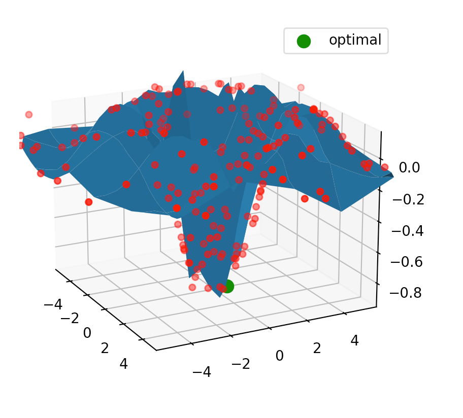

# Infill Pipeline Tutorial

The pipeline application takes the ranges of the parameters and constructs the search space. As part of the setup process, it will also set up a root folder for the experiment. This root folder will contain: template files for running the EPSC apps, various configuration files, and logs. 

A budgeted sequential multi-objective optimization algorithm first generates a search space. From the search space, a space filling design (e.g. latin hypercube) is constructed to train the initial surrogate model. For example, if there are 14 parameters, the initial design will contain 14\*10 data points– the number of parameters * 10 is what’s recommended in practice. (Note that the amount of total runs given a budget of 200 would be 14\*10 + 200 = 340.)

The budget controls for how long the experiment will run after the surrogate (Gaussian process) model is trained on the initial design points.

The sequential infilling can then start by finding new candidate points– i.e. explore the search space. The algorithm to find new candidate points is called S-Metric-Selection-Based Efficient Global Optimization (SMS-EGO).

Once the budget is exhausted, a Pareto set is produced. The best settings for the experiment are from the Pareto set. There are many ways to pick out points from the Pareto set– e.g. smallest average error over all objectives, plot curves for each objective, clustering, etc.

The result of the experiment will be written out to log files– the curves and error/cost for each objective given a set of parameters, the final surrogate model, etc.


A more in-depth look at sequential infilling, in general.


## Architecture

InfillPipeline is the primary workhorse which sets up the initial design matrix and performs the sequentially infilling until a budget is exhausted. 

Blackbox is a class that should be subclasssed for your experiment if more customization is needed. Functions that need to be implemented are: Blackbox#setup(...), and Blackbox#obj_fun(...).

InfillPipeline takes an instance of Blackbox. InfillPipeline will invoke Blackbox#setup(...) and Blackbox#obj_fun(...).

For example:

```python
cur_datetime = datetime.datetime.today().strftime('%Y%m%d_%H%M%S')
run_id = utility.generate_run_id(cur_datetime)
bb = SimpleCase(run_id, config.data_loaded['system']['run_folder'], 
     config.data_loaded['simple']['lower'], config.data_loaded['simple']['upper'], config.data_loaded['simple'])
ip = InfillPipeline(run_id, 
        config.data_loaded['simple']['lower'],
        config.data_loaded['simple']['upper'],
        config.data_loaded['system']['run_folder'],
        config.data_loaded['system']['sqlite_db'],
        config.data_loaded['infill'],
        blackbox=bb
        )
try:
     ip.run()                              
finally:
     utility.log_run()
```

### Performance/Budget

The performance of a sequential infilling algorithm depends on the budget size. From various experiments, for CPM problems a budget between 120 and 200 gave good results.  

## Simple Non-CPM Example

With 1 objective, we will just use particle swarm optimization. The purpose of this example is too see what configuration file looks like:

This example will show how we can find a minimum of a surface. The true surface is f(x,y)=-1*sin(sqrt(x^2 + y^2))/sqrt(x^2 + y^2) where 
x=(-8, 8) and y=(-8, 8).


```
system:
  should_run_batch: True
  rerun_batch: True
  run_folder: '/Users/<User>/Documents/code/experiments_simple'
  log_r_file: 'log_r.txt'
  sqlite_db: 'sqlite.db'
  # Timeout in seconds
  subprocess_timeout: 1200

infill:
  budget: 50
  selected_cases: [1]
  case_ids: [1]
  design_num_obs: 20
  # Number of params that will be searched in the parameter space,
  # so this must not include fixed parameters. A fixed
  # parameter should be defined in 'lower' and 'upper' with
  # the same value at index j
  design_num_of_param: 2
  design_num_of_responses: 1
  r_design_init_out_file: 'design_init.csv'
  r_design_init_response_out_file: 'design_init_responses.csv'
  # Relative to system.run_folder
  infill_out_file: 'infill_out.csv'
  infill_lock_file: 'infill_out.lock'
  rerun_design_matrix: False

simple:
  lower: [-8, -8]
  upper: [8, 8]
  should_rerun_setup: False
```

```python
cur_datetime = datetime.datetime.today().strftime('%Y%m%d_%H%M%S')
run_id = utility.generate_run_id(cur_datetime)
bb = SimpleCase(run_id, config.data_loaded['system']['run_folder'], 
     config.data_loaded['simple']['lower'], config.data_loaded['simple']['upper'], config.data_loaded['simple'])
ip = InfillPipeline(run_id, 
        config.data_loaded['simple']['lower'],
        config.data_loaded['simple']['upper'],
        config.data_loaded['system']['run_folder'],
        config.data_loaded['system']['sqlite_db'],
        config.data_loaded['infill'],
        blackbox=bb
        )
try:
     ip.run()                              
finally:
     utility.log_run()
```





## CPM

This is a case where we seek to find parameters to optimize a CPM problem.

For each data point, a template file is written out with the appropriate parameters. The EPSC apps will then run and its output will be saved. The error values for each objective will then be used to train an initial surrogate model.

Our implementation of Blackbox will be more involved than the earlier trivial example. The Blackbox#obj_fun(...) that gets called must run a set of EPSC apps and set an appropriate timeout, so that they don't run forever.


### Configuration file

```
system:
  should_run_batch: True
  rerun_batch: True
  run_folder: '/Users/<User>/Documents/code/experiments_py_infill_pipeline'
  log_r_file: 'log_r.txt'
  sqlite_db: 'sqlite.db'
  # Timeout in seconds
  subprocess_timeout: 1200
  
cpm:
  lower: [0.9, 1e8,  0.1, 1e2, 200,  0.01,  200, 1e8, 0.1, 2e2, 100, 0.000, 1e6,     9,   60, 0.1, 0.1, 0.01]
  upper: [0.9,   2e8, 0.25, 2e2, 400, 0.08,   400, 3e8,  0.4,  4e2, 500, 0.000,  1e6, 13, 100,   0.8, 0.5,   0.08]
  param_fname: ['FCC_aust.SX', 'HCP_mart.SX', 'BCC_mart.SX', 'phtr.in']
  param_fname_template: ['FCC_aust.SX.liquid', 'HCP_mart.SX.liquid', 'BCC_mart.SX.liquid', 'phtr.in.liquid']
  num_of_vf_response_to_include: 4
  # Relative to system.run_folder
  EPSC_source_folder: 'EPSCSource'
  # Relative to system.run_folder
  running_folder: 'RunningFolder'
  should_rerun_setup: False
  # Assume that the executable produces this output file
  EPSC_output_file: 'output 1.out'
  EPSC_linux_executable: 'a.out'
  # Relative to system.run_folder
  case_fname: 'Inp_WhatToFit_PT.csv'
  # Relative to system.run_folder
  fit_param_fname: 'Inp_FittingParams_PT.csv'
  recipe_fname: 'Inp_Fit_recipes_PT.in'
  info_fname: 'Inp_Info_PT.yaml'

```
YAML files are used when possible, e.g. Inp_Info_Pt.yaml:
```
# Shifting, 0 - no shifting, non-zero - specifies the amount of shifting, 
# third value - specifies number of shifting increments
fitting_strategies: [0, -0.01, 0, 21]
# Saving data
save_data: True
# Plot final fit, 0 - no plotting, 1 - plot in 1 figure, 2 - plot separately
plot_final_fit:  0
model:
  num_of_param_files: 4
  param_files: ['FCC_aust.sx', 'HCP_mart.SX', 'BCC_mart.sx', 'phtr.in']
```

### Template liquid files

Template liquid templates is a clean way to inject parameters (with filtering) into a multi-line text.

For example, this is BCC_mart.SX.liquid. The parameter interpolation is done with ```{{par[10] | filter_string_format: '%9.5f'}}```.
```
Martensite
CUBIC             crysym
   1.   1.   1.    90.   90.   90.   unit cell axes and angles
Elastic stiffness for martensite Wang et al.:
 234.0e3   135.0e3   135.0e3   000.0e3   000.0e3   000.0e3
 135.0e3   234.0e3   135.0e3   000.0e3   000.0e3   000.0e3
 135.0e3   135.0e3   234.0e3   000.0e3   000.0e3   000.0e3
 000.0e3   000.0e3   000.0e3   118.0e3   000.0e3   000.0e3
 000.0e3   000.0e3   000.0e3   000.0e3   118.0e3   000.0e3
 000.0e3   000.0e3   000.0e3   000.0e3   000.0e3   118.0e3
*Large elastic strain & pressure dependent Cij (kSM=0 or 1)
 0 	
*Thermal expansion coefficients of single crystal[K^(-1)]
  0.0e-6   0.0e-6  0.0e-6   0.0e0   0.0e0   0.0e0
SLIP AND TWINNING MODES
1                               nmodesx
1                               nmodes
1                               mode(i)
    {110}<111> SLIP
  1   12   20    1   0                modex,nsmx,nrsx,isensex,itwx
    0    1    1     1    1   -1       slip (n-b)
    1    0    1     1    1   -1
    1   -1    0     1    1   -1
    0    1   -1     1   -1   -1
    1    0    1     1   -1   -1
    1    1    0     1   -1   -1
    0    1    1     1   -1    1
    1    0   -1     1   -1    1
    1    1    0     1   -1    1
    0    1   -1     1    1    1
    1    0   -1     1    1    1
    1   -1    0     1    1    1
DISLOCATION MODEL   
 1									                !iDiag (diagonalize hd matrix)
 {{par[0] | filter_string_format: '%5.3f'}}  4.0  25.0                   !INTERACTION CONSTANT, Q IN EQ. (3.14), grain size !, PORTION OF REVERSIBLE DISLOC
SLIP---------------------------------------------------------------------------------------------
 2.488e-10  {{ par[8] | filter_string_format: '%9.5f' }}         	     !BURG (m), NORM ACTENER g IN EQ. (3.12) (0.00375)
 {{ par[7] | filter_string_format: '%9.5e'}} {{ par[9] | filter_string_format: '%9.5f'}}               !KGENER-K1 IN EQ. (3.8) (1/m), DRAG STRESS-D IN EQ. (3.12) (Pa) 330.
 1.E+07                              ! EDOT_O IN EQ. (3.12)
 3.0e+11  1.E-01                   !INITIAL RHO_S (1/m^2), INITIAL RHO_DEB FOR EACH SLIP MODE (1/m^2)
 {{par[10] | filter_string_format: '%9.5f'}}  {{par[11] | filter_string_format: '%9.5f'}}  {{par[12] | filter_string_format: '%9.5f'}}                !A,B,C FOR EDOT AND TEMP SENSITIVE TAU = A*(1 + B * LOG(EDOT))*EXP(-TEMP/C) EQ. (3)
 0.0  0.0   0.0                      !FOR HPFAC COEF FOR THIS SLIP MODE FOR GRAIN BOUNDARY, TWIN1 BOUNDARY, TWIN2 BOUNDARY
 2.0 0. 30.                        !Q0,Q1,Q2, (K) FOR A IN EQ. (3.15) Q0+Q1*LOG(1+TEMP/Q2), a_deb_a ...
 0.0 0.5                            !p_rev(iph),aM_par(iph)
 0                                  !iFCC
 1.0e 0.99e 0.99 0.99e 0.99 0.99 	  !d0,d1,d2,d3,d4,d5(for FCC)
 1.0  0.0   0.0  0.0   0.0  0.0   	!g0,g1,g2,g3,g4,g5
 1.0 1.0                            !rev_coeff(1,iph),rev_coeff(2,iph)

```

### Integration with Abaqus

(WIP)

## Limitations

* Not tested on Windows yet but should work

## References

